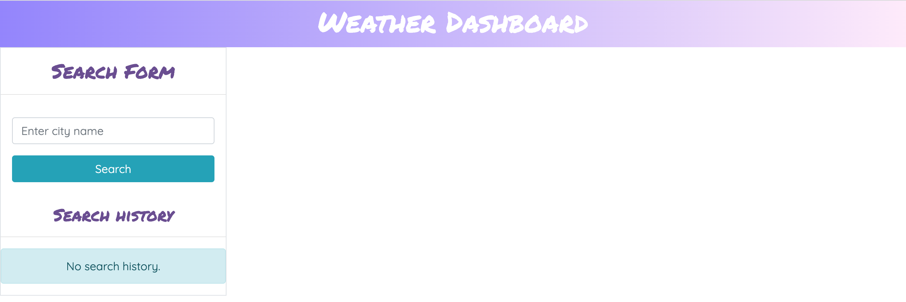
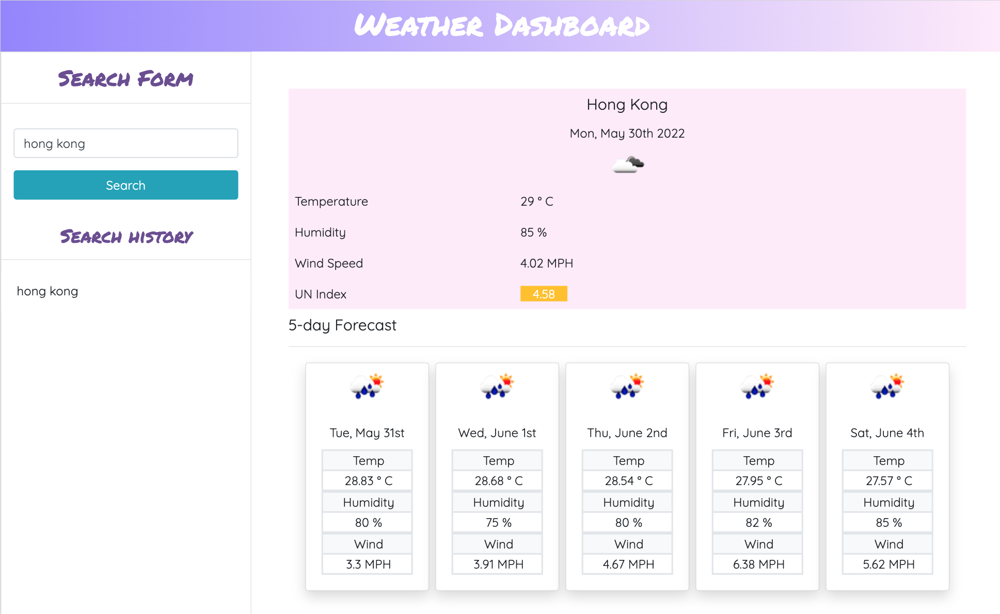

# weather-dashboard

## This is the repository for the weather dashboard

### UI:

```
User may search a city's weather information
```



```
The app will show the current weather and 5-day forecast information of that city
with temperature, the humidity, the wind speed, and the UV index.

UV index will be indicated by different colors to show whether the conditions are favorable, moderate, or severe.
User may click on a city in the search history to review the information again.
```



### Link:

Click [https://angelawong3.github.io/weather-dashboard/](https://angelawong3.github.io/weather-dashboard/) to go to the page.

---

© Angela Wong
